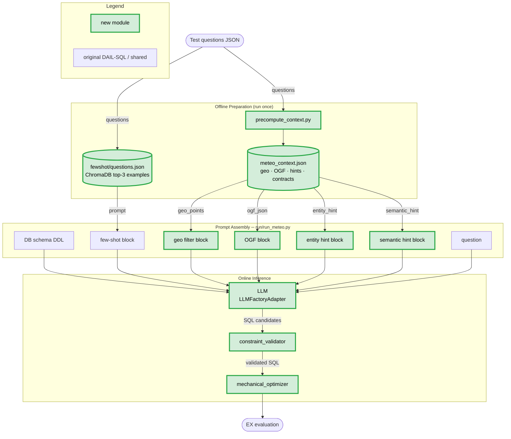

# DAIL-SQL — Meteo Domain Extension

Prompt-engineering baseline for Text-to-SQL on the meteo dataset.
Extends the original [DAIL-SQL](https://arxiv.org/abs/2308.15363) (86.6% on Spider) with four
domain-specific contributions — geo context, ontology-grounded functions (OGF), a constraint
validator, and a mechanical SQL optimizer — implemented as a zero-invasive overlay in `meteo/`
and `run/`.

---

## Pipeline

### Overall flow



### Ablation levels

| Mode | Geo block | OGF + Validator | Entity + Semantic hints | Optimizer |
| --- | :---: | :---: | :---: | :---: |
| `baseline` | | | | |
| `geo` | ✓ | | | |
| `ogf` | ✓ | ✓ | | |
| `hints` | ✓ | ✓ | ✓ | |
| `full` | ✓ | ✓ | ✓ | ✓ |

### New modules

| Module | Role |
| --- | --- |
| `meteo/geo_adapter.py` | Keyword lookup in `src/places/` → `(latitude, longitude) IN (…)` comment block |
| `meteo/meteo_entity_hint.py` | Maps variable names (temperature, wind…) to `table.column` with unit notes |
| `meteo/meteo_semantic_hint.py` | Classifies question into access pattern and injects SQL guidance |
| `meteo/llm_adapter.py` | Wraps `LLMFactoryAdapter` — any provider, `<think>` stripping, parallel n-candidate generation |
| `meteo/precompute_context.py` | One-time offline script that produces `meteo_context.json` |
| `run/run_meteo.py` | End-to-end runner: prompt build → LLM → validate → optimize → EX eval → XLSX |
| `runner/` | Local copy of PostgreSQL execution utilities |
| `llm/` | Local copy of LLM adapter and prompt classes (self-contained) |
| `scripts/preprocess_test_data.py` | Converts `test_data.xlsx` → `data/data_preprocess/*.json` |
| `scripts/build_fewshot_index.py` | Builds ChromaDB index from `train_data.xlsx`, writes `data/fewshot/questions.json` |

---

## Installation

```shell
# From project root (ontology_retriever/)
uv sync
```

Environment variables (`.env` in project root):

| Variable | Required for |
| --- | --- |
| `DB_HOST` / `DB_PORT` / `DB_NAME` / `DB_USER` / `DB_PASS` | PostgreSQL (EX evaluation) |
| `AWS_ACCESS_KEY_ID` / `AWS_SECRET_ACCESS_KEY` / `AWS_REGION` | Bedrock LLM provider |
| `SWISS_AI_BASE_URL` / `SWISS_AI_API_KEY` / `SWISS_AI_MODEL` | Swiss AI / CSCS provider |
| `OPENAI_API_KEY` | OpenAI provider |

LLM provider is configured via `config/models.yaml` in the project root.

---

## Evaluation Constraints

### No SQL-structure similarity in few-shot selection

The original DAIL-SQL paper uses SQL skeleton similarity to rank few-shot candidates. **This is prohibited in our meteo evaluation** because:

1. **Test contamination** — the gold SQL is the inference target and does not exist at test time.
2. **Unfair comparison** — any result boost from SQL-skeleton selection would come from privileged access to the answer.

Our few-shot index uses **question-text embeddings only** (SentenceTransformer on the natural language question). SQL strings are stored as metadata for display but never used for similarity computation.

---

## Offline Setup (run once)

All commands from **project root** (`ontology_retriever/`).

### Step 1 — Preprocess test data

Converts `test_data.xlsx` → `src/DAIL-SQL/data/data_preprocess/test_data_point.json` and `test_data_bbox.json`.

```shell
uv run python src/DAIL-SQL/scripts/preprocess_test_data.py
```

### Step 2 — Build few-shot index

Embeds training questions, builds ChromaDB collection, writes `src/DAIL-SQL/data/fewshot/questions.json`.

```shell
uv run python src/DAIL-SQL/scripts/build_fewshot_index.py --rebuild
```

### Step 3 — Precompute meteo context

Computes geo points, OGF, entity hint, and semantic hint for every unique question. No LLM needed. Runs in ~5 min for 752 questions.

```shell
uv run python src/DAIL-SQL/meteo/precompute_context.py
# outputs to src/DAIL-SQL/data/meteo_context.json (default)
```

If `--meteo-context` is not passed to `run_meteo.py`, it auto-triggers this step using `src/DAIL-SQL/data/meteo_context.json`.

---

## Running Evaluations

All commands from **project root** (`ontology_retriever/`).

### Single configuration — `run_meteo.py`

```shell
# Smoke test: 10 questions, full config, few-shot
uv run src/DAIL-SQL/run/run_meteo.py \
    --ablation full \
    --fewshot \
    --end 10 \
    --export-xlsx

# Full test set, few-shot, full config
uv run src/DAIL-SQL/run/run_meteo.py \
    --ablation full \
    --fewshot \
    --end -1 \
    --export-xlsx

# Zero-shot baseline
uv run src/DAIL-SQL/run/run_meteo.py \
    --ablation baseline \
    --end -1 \
    --export-xlsx

# Bbox variant
uv run src/DAIL-SQL/run/run_meteo.py \
    --dataset src/DAIL-SQL/data/data_preprocess/test_data_bbox.json \
    --ablation full \
    --fewshot \
    --end -1 \
    --export-xlsx
```

**Flags:**

| Flag | Default | Description |
| --- | --- | --- |
| `--dataset` | `src/DAIL-SQL/data/data_preprocess/test_data_point.json` | Path to test JSON |
| `--ablation` | `full` | Ablation mode: `baseline`, `geo`, `ogf`, `hints`, `full` |
| `--fewshot` | off | Inject top-3 few-shot examples from the precomputed ChromaDB index |
| `--end` | `10` | Max questions to evaluate (`-1` = all) |
| `--indices` | — | Comma-separated question indices, e.g. `570,573` (overrides `--end`) |
| `--n` | `1` | SQL candidates per question |
| `--temperature` | `0.0` | Sampling temperature |
| `--meteo-context` | `src/DAIL-SQL/data/meteo_context.json` | Path to precomputed context |
| `--fewshot-path` | `src/DAIL-SQL/data/fewshot/questions.json` | Fewshot lookup file |
| `--output-dir` | `src/DAIL-SQL/results` | Base results directory |
| `--export-xlsx` | off | Write `report.xlsx` alongside results |
| `--llm-config` | `config/models.yaml` | Path to LLM config YAML |

### Full 5-level ablation suite

```shell
for ablation in baseline geo ogf hints full; do
    uv run src/DAIL-SQL/run/run_meteo.py \
        --ablation $ablation \
        --fewshot \
        --end -1 \
        --export-xlsx
done
```

---

## Results Directory Layout

```text
src/DAIL-SQL/results/
└── <model_name>/
    ├── full/
    │   ├── fewshot/
    │   │   └── 20260519_120000/
    │   │       ├── predictions.txt
    │   │       ├── results.jsonl
    │   │       ├── summary.json
    │   │       ├── report.xlsx
    │   │       └── llm_io/
    │   └── no_fewshot/
    ├── baseline/
    ├── geo/
    ├── ogf/
    └── hints/
```

---

## LLM Configuration

Provider and model are read from `config/models.yaml` (project root):

```yaml
# Bedrock
provider: bedrock
model: qwen.qwen3-next-80b-a3b
temperature: 0.0
enable_thinking: false

# Swiss AI / CSCS
provider: swiss_ai
model: "Qwen/Qwen3.5-27B"
temperature: 0.0

# OpenAI
provider: openai
model: gpt-4o
temperature: 0.0
```

---

## Original DAIL-SQL Reference

> Dawei Gao, Haibin Wang, Yaliang Li, Xiuyu Sun, Yichen Qian, Bolin Ding and Jingren Zhou.
> *Text-to-SQL Empowered by Large Language Models: A Benchmark Evaluation.*
> CoRR abs/2308.15363 (2023). [arXiv](https://arxiv.org/abs/2308.15363)
